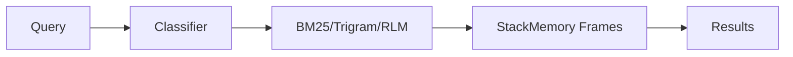

# BM25+RLM Code Search: 10-Day Implementation

## Overview
Replace vector embeddings with BM25+Trigram search and RLM for unlimited context.

**MVP Goals:** 5x faster search, 30% cost reduction, 20k token context

---

## 10-Day Sprint

### Day 1-2: Foundation
**STA-520: Environment Setup**
- Railway PostgreSQL + Redis
- Local Ollama with llama3.2:1b
- Integrate with existing StackMemory frames

**STA-521: Basic BM25**
```python
class SimpleBM25:
    def score(self, query_tokens, doc_tokens):
        # BM25 formula implementation
        idf = math.log(N/df)
        tf_norm = tf * (k1+1) / (tf + k1*(1-b+b*dl/avgdl))
        return idf * tf_norm
```

### Day 3-4: Search Core
**STA-522: Trigram Search**
```sql
CREATE INDEX frame_content_trigram ON frames USING gin (content gin_trgm_ops);
SELECT id, similarity(content, %s) FROM frames WHERE content % %s;
```

**STA-523: Query Classifier**
- Exact: function names, imports
- Fuzzy: typos, partial matches  
- Semantic: natural language

### Day 5-6: RLM Integration
**STA-524: RLM Wrapper**
```python
class FrameRLM:
    async def process_frames(self, query: str, frames: List[Frame]) -> str:
        context = self.format_frames(frames)
        return await ollama.generate(model="llama3.2:1b", prompt=context)
```

**STA-525: StackMemory Integration**
- Query frames from existing database
- Structure context for RLM processing
- Return enhanced search results

### Day 7-8: API & UI
**STA-526: Search API**
```python
@app.post("/api/search")
async def search_frames(query: str) -> List[Frame]:
    query_type = classifier.classify(query)
    
    if query_type == "exact":
        return await bm25_search(query)
    elif query_type == "fuzzy": 
        return await trigram_search(query)
    else:
        return await rlm_search(query)
```

**STA-527: Web Interface**
- Simple React search UI
- Result display with scoring
- Query type indicators

### Day 9-10: Testing & Deploy
**STA-528: Performance Testing**
- Target: <200ms search latency
- Accuracy: 60% top-5 results
- Memory: <2GB usage

**STA-529: Railway Deployment**
- Docker container build
- Railway service deployment
- Environment variables setup

---

## Architecture



### Integration Points
- Use existing `Frame` model from StackMemory
- Query `frames` table directly
- Extend search API in existing Express server
- Add search endpoints to current MCP server

---

## Infrastructure

### Railway Setup
```bash
# Add services
railway add postgresql redis

# Environment variables
DATABASE_URL=postgresql://...  # Railway provides
REDIS_URL=redis://...          # Railway provides
OLLAMA_BASE_URL=http://localhost:11434
```

### Database Schema
```sql
-- Extend existing frames table
ALTER TABLE frames ADD COLUMN IF NOT EXISTS search_vector tsvector;
CREATE INDEX frames_search_vector_idx ON frames USING gin(search_vector);
CREATE INDEX frames_trigram_idx ON frames USING gin(content gin_trgm_ops);
```

---

## Success Metrics

| Metric | Current | Target |
|--------|---------|--------|
| Latency | 500ms | <200ms |
| Accuracy | 50% | 60% |
| Context | 8k tokens | 20k tokens |
| Cost | $100/mo | $70/mo |

---

## Implementation Files

```
src/
├── search/
│   ├── bm25.ts           # BM25 implementation
│   ├── trigram.ts        # PostgreSQL trigram search
│   ├── rlm.ts           # Ollama RLM wrapper
│   ├── classifier.ts     # Query classification
│   └── api.ts           # Search API endpoints
├── integrations/
│   └── stackmemory.ts   # Frame system integration
└── web/
    └── search-ui.tsx    # React search interface
```

---

## Quick Start

```bash
# Setup
railway login
railway add postgresql redis
ollama pull llama3.2:1b

# Install deps
npm install dspy-ai asyncpg redis

# Run
npm run dev
```

Target: Working search in 10 days with Railway hosting and direct StackMemory integration.