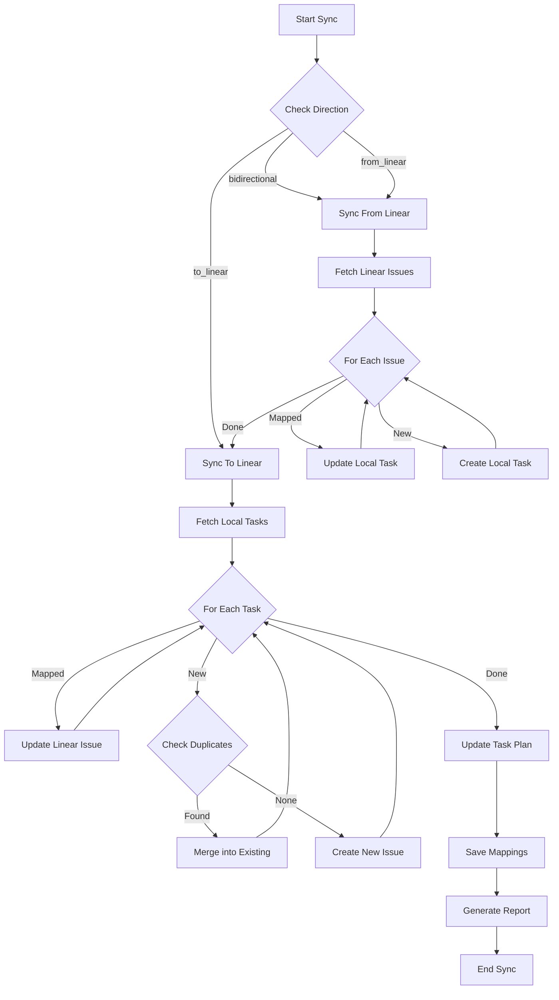

# Unified Linear Sync System Documentation

## Overview

The Unified Linear Sync System consolidates all Linear integration functionality into a single, coherent system with duplicate detection, bidirectional sync, and task planning capabilities.

## Key Features

### 1. **Duplicate Detection** 
- Prevents creating duplicate issues in Linear
- Uses Levenshtein distance algorithm for fuzzy title matching (85% similarity threshold)
- Three merge strategies: `merge_content`, `skip`, or `create_anyway`
- Automatically merges content into existing issues when duplicates are detected

### 2. **Bidirectional Sync**
- Full bidirectional sync between StackMemory and Linear
- Three sync directions: `bidirectional`, `to_linear`, `from_linear`
- Conflict resolution strategies: `newest_wins`, `linear_wins`, `local_wins`, `manual`
- Maintains persistent mapping between local tasks and Linear issues

### 3. **Task Planning Integration**
- Automatically generates task plans and reports
- Organizes tasks by phases (Backlog, In Progress, Completed)
- Creates markdown reports with sync statistics
- Tracks task dependencies and relationships

## Architecture

### Core Components

```
src/integrations/linear/
├── unified-sync.ts         # Main unified sync engine
├── sync-enhanced.ts         # Duplicate detection system
├── client.ts               # GraphQL client with rate limiting
├── auth.ts                 # Authentication management
└── config.ts               # Configuration management

src/cli/commands/
└── linear-unified.ts       # Unified CLI commands
```

### Class Hierarchy

```typescript
UnifiedLinearSync (EventEmitter)
├── LinearClient (GraphQL API)
├── LinearDuplicateDetector (Fuzzy matching)
├── PebblesTaskStore (Local storage)
└── LinearAuthManager (OAuth/API key)
```

## Configuration

### UnifiedSyncConfig

```typescript
{
  // Core settings
  enabled: boolean;
  direction: 'bidirectional' | 'to_linear' | 'from_linear';
  defaultTeamId?: string;
  
  // Duplicate detection
  duplicateDetection: boolean;
  duplicateSimilarityThreshold: number; // 0-1, default 0.85
  mergeStrategy: 'merge_content' | 'skip' | 'create_anyway';
  
  // Conflict resolution
  conflictResolution: 'newest_wins' | 'linear_wins' | 'local_wins' | 'manual';
  
  // Task planning
  taskPlanningEnabled: boolean;
  taskPlanFile?: string; // Default: .stackmemory/task-plan.md
  autoCreateTaskPlan: boolean;
  
  // Performance
  maxBatchSize: number;
  rateLimitDelay: number; // ms between requests
  maxRetries: number;
  
  // Auto-sync
  autoSync: boolean;
  autoSyncInterval?: number; // minutes
  quietHours?: {
    start: number; // hour 0-23
    end: number;
  };
}
```

## Usage

### Basic Sync

```bash
# Bidirectional sync with duplicate detection
stackmemory linear sync

# One-way sync from Linear only
stackmemory linear sync --direction from_linear

# Sync with task planning
stackmemory linear sync --task-plan

# Dry run to preview changes
stackmemory linear sync --dry-run
```

### Daemon Mode

```bash
# Run as background daemon with 15-minute interval
stackmemory linear sync --daemon --interval 15

# Daemon with specific configuration
stackmemory linear sync --daemon \
  --direction bidirectional \
  --merge-strategy merge_content \
  --conflict newest_wins \
  --task-plan
```

### Duplicate Management

```bash
# Check if a title would create a duplicate
stackmemory linear duplicates --check "Implement user authentication"

# List all potential duplicates
stackmemory linear duplicates --list

# Merge detected duplicates
stackmemory linear duplicates --merge
```

### Task Planning

```bash
# Generate task plan from current tasks
stackmemory linear plan --generate

# View task report
stackmemory linear plan --report

# View task plan overview
stackmemory linear plan
```

### Authentication

```bash
# Using API key (recommended for automation)
stackmemory linear auth --api-key lin_api_xxxxx

# OAuth flow (for user-facing applications)
stackmemory linear auth --oauth
```

## Sync Process Flow



## Duplicate Detection Algorithm

The system uses a multi-step approach:

1. **Title Normalization**
   - Convert to lowercase
   - Remove special characters
   - Strip issue prefixes (STA-123, etc.)
   - Normalize whitespace

2. **Similarity Calculation**
   - Levenshtein distance algorithm
   - 85% similarity threshold by default
   - Configurable threshold (0-1)

3. **Merge Strategy**
   - `merge_content`: Append new content to existing issue
   - `skip`: Don't create, just map to existing
   - `create_anyway`: Create despite duplicate

## File Structure

### Generated Files

```
.stackmemory/
├── linear-mappings.json    # Task ID to Linear ID mappings
├── task-plan.json          # Structured task plan
├── task-plan.md            # Human-readable task plan
├── task-report.md          # Latest sync report
└── sync-stats.json         # Sync statistics
```

### Mapping Format

```json
{
  "local-task-id-1": "linear-issue-id-1",
  "local-task-id-2": "linear-issue-id-2"
}
```

## Event System

The UnifiedLinearSync class emits events:

```typescript
// Sync started
unifiedSync.on('sync:started', ({ config }) => {
  console.log('Sync started with config:', config);
});

// Sync completed
unifiedSync.on('sync:completed', ({ stats }) => {
  console.log('Sync completed:', stats);
});

// Sync failed
unifiedSync.on('sync:failed', ({ stats, error }) => {
  console.error('Sync failed:', error);
});
```

## Performance Optimization

1. **Rate Limiting**
   - Configurable delay between API calls
   - Automatic retry with exponential backoff
   - Request queue management

2. **Batch Processing**
   - Process tasks in configurable batch sizes
   - Parallel processing where possible
   - Cache duplicate detection results

3. **Incremental Sync**
   - Track last sync timestamp
   - Only sync changed items
   - Persistent mapping cache

## Error Handling

1. **Authentication Errors**
   - Automatic token refresh for OAuth
   - Clear error messages for API key issues

2. **Network Errors**
   - Configurable retry attempts
   - Exponential backoff strategy
   - Graceful degradation

3. **Data Conflicts**
   - Multiple resolution strategies
   - Detailed conflict reporting
   - Manual review option

## Migration from Old System

### Deprecated Scripts to Remove

The following scripts are now redundant and can be removed:

```
scripts/linear-auto-sync.js
scripts/sync-linear-tasks.js
scripts/linear-sync-daemon.js
scripts/sync-linear-graphql.js
scripts/sync-and-clean-tasks.js
scripts/merge-linear-duplicates.ts
scripts/clean-duplicate-tasks.js
```

### Configuration Migration

Old configuration in various scripts should be migrated to the unified config:

```typescript
// Old (in multiple scripts)
const config = {
  direction: 'from_linear',
  autoSync: true,
  conflictResolution: 'linear_wins'
};

// New (unified)
const config: UnifiedSyncConfig = {
  direction: 'from_linear',
  duplicateDetection: true,
  mergeStrategy: 'merge_content',
  conflictResolution: 'linear_wins',
  taskPlanningEnabled: true,
  // ... other settings
};
```

## Best Practices

1. **Always enable duplicate detection** in production
2. **Use task planning** for better visibility
3. **Run sync daemon** for continuous synchronization
4. **Monitor sync stats** for performance issues
5. **Review conflict reports** regularly
6. **Use dry-run** before major sync operations

## Troubleshooting

### Common Issues

1. **"Duplicate issues being created"**
   - Enable duplicate detection: `--no-duplicates=false`
   - Adjust similarity threshold if needed
   - Check merge strategy setting

2. **"Sync taking too long"**
   - Reduce batch size in config
   - Increase rate limit delay
   - Check network connectivity

3. **"Authentication failing"**
   - Verify API key or OAuth tokens
   - Check token expiration
   - Ensure proper permissions

4. **"Conflicts not resolving"**
   - Review conflict resolution strategy
   - Check for circular dependencies
   - Consider manual resolution

## Future Enhancements

1. **Advanced Duplicate Detection**
   - Machine learning-based similarity
   - Content-based matching
   - Historical pattern analysis

2. **Smart Sync Scheduling**
   - Activity-based sync triggers
   - Predictive sync timing
   - Resource-aware scheduling

3. **Enhanced Task Planning**
   - Gantt chart generation
   - Dependency visualization
   - Sprint planning integration

4. **Multi-team Support**
   - Cross-team sync
   - Team-specific configurations
   - Hierarchy management