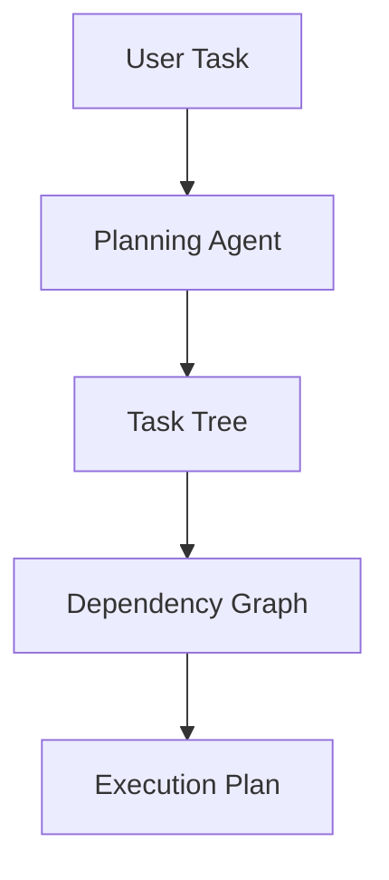
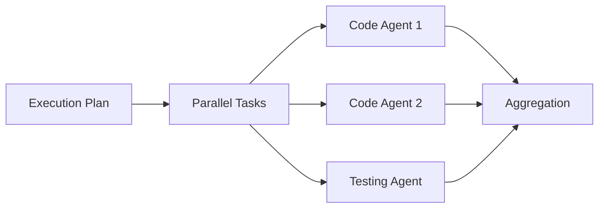
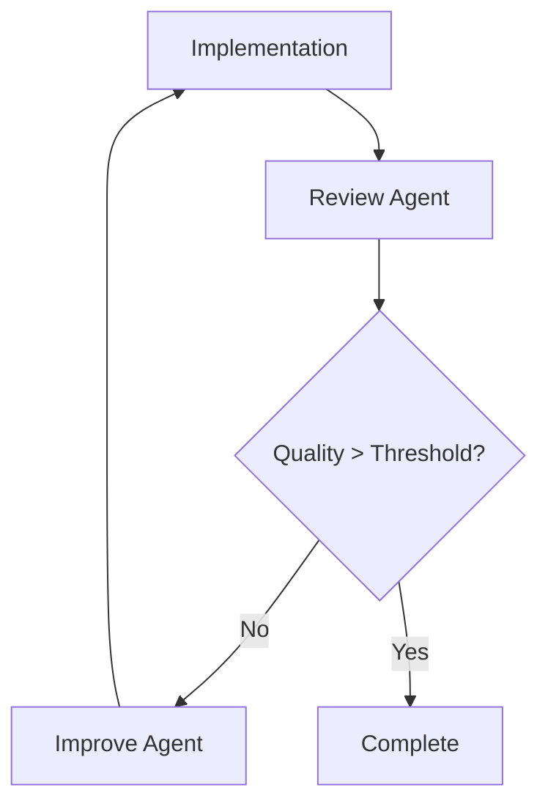

# Recursive Language Model (RLM) Specification

## Overview

The Recursive Language Model (RLM) system for StackMemory implements the concepts from the "Recursive Language Models" paper, enabling Claude Code to handle arbitrarily complex tasks through recursive decomposition and parallel execution using Claude Code's Task tool.

## Key Features

### 1. **Claude Code Task Tool Integration**
- Uses Claude Code Max plan's Task tool for spawning subagents
- No direct API calls required - leverages existing Claude Code infrastructure
- Unlimited subagent execution with Claude Code Max plan
- Full transparency of all recursive operations

### 2. **Parallel Execution**
- Execute multiple subagents concurrently
- Dependency resolution and DAG execution
- Rate limiting and resource pooling
- Automatic retry on failure

### 3. **Automatic Test Generation**
- Comprehensive test suite generation
- Unit, integration, and E2E test creation
- Coverage analysis and validation
- Test execution and verification

### 4. **Multi-Stage Code Review**
- Iterative review and improvement cycles
- Quality scoring (0-1 scale)
- Specific improvement suggestions
- Automatic implementation of fixes

## Architecture

### Core Components

```
┌─────────────────────────────────────────┐
│     Recursive Agent Orchestrator        │
│  /src/skills/recursive-agent-orchestrator.ts │
└────────────┬────────────────────────────┘
             │
    ┌────────┴────────┬─────────────┬──────────────┐
    ▼                 ▼             ▼              ▼
┌──────────┐  ┌──────────────┐  ┌─────────────┐  ┌───────────────┐
│ Parallel │  │ Context      │  │ Claude Code │  │ Subagent      │
│ Executor │  │ Manager      │  │ Client      │  │ Types         │
└──────────┘  └──────────────┘  └─────────────┘  └───────────────┘
```

### Subagent Types

1. **Planning Agent**
   - Task decomposition
   - Dependency analysis
   - Execution strategy
   - Parallel opportunity identification

2. **Code Agent**
   - Implementation
   - Refactoring
   - Optimization
   - Documentation

3. **Testing Agent**
   - Test generation
   - Test execution
   - Coverage analysis
   - Validation

4. **Linting Agent**
   - Code quality checks
   - Format verification
   - Security scanning
   - Performance analysis

5. **Review Agent**
   - Architecture evaluation
   - Code quality assessment
   - Security review
   - Performance implications

6. **Improve Agent**
   - Implement review feedback
   - Refactor for quality
   - Optimize performance
   - Enhance documentation

7. **Context Agent**
   - Information retrieval
   - Pattern matching
   - Best practice lookup
   - Dependency analysis

8. **Publish Agent**
   - NPM publishing
   - GitHub releases
   - Documentation updates
   - Deployment automation

## Execution Flow

### 1. Task Decomposition


### 2. Parallel Execution


### 3. Review Cycle


## Usage

### Basic Command
```bash
stackmemory skill rlm "Your task description"
```

### With Options
```bash
stackmemory skill rlm "Refactor authentication system" \
  --max-parallel 8 \
  --review-stages 5 \
  --quality-threshold 0.9 \
  --test-mode all \
  --verbose
```

### Examples

#### 1. Generate Comprehensive Tests
```bash
stackmemory skill rlm "Generate comprehensive tests for the API endpoints" \
  --test-mode all \
  --review-stages 3
```

#### 2. Large Codebase Refactoring
```bash
stackmemory skill rlm "Refactor the entire authentication system to use JWT" \
  --max-parallel 10 \
  --quality-threshold 0.95
```

#### 3. Multi-Step Workflow
```bash
stackmemory skill rlm "Build, test, and publish version 2.0.0" \
  --review-stages 2
```

## Configuration

### Environment Variables
```bash
# Claude Code integration (uses Task tool, not API)
CLAUDE_CODE_MAX_PLAN=true  # Required for unlimited subagents

# RLM specific settings
RLM_MAX_PARALLEL=5          # Max concurrent subagents
RLM_MAX_RECURSION=4         # Max recursion depth
RLM_REVIEW_STAGES=3         # Default review iterations
RLM_QUALITY_THRESHOLD=0.85  # Target quality score
RLM_VERBOSE=true           # Show all operations
```

### Options

| Option | Description | Default |
|--------|-------------|---------|
| `--max-parallel` | Maximum concurrent subagents | 5 |
| `--max-recursion` | Maximum recursion depth | 4 |
| `--max-tokens-per-agent` | Token budget per subagent | 30000 |
| `--review-stages` | Number of review iterations | 3 |
| `--quality-threshold` | Target quality score (0-1) | 0.85 |
| `--test-mode` | Test generation mode (unit/integration/e2e/all) | all |
| `--verbose` | Show all recursive operations | true |
| `--share-context-realtime` | Share discoveries between agents | true |
| `--retry-failed-agents` | Retry on failure | true |
| `--timeout-per-agent` | Timeout in seconds | 300 |

## Context Management

### Chunking Strategies

1. **File-based Chunking**
   - Split by file boundaries
   - Respect language semantics
   - Maintain import relationships

2. **Semantic Chunking**
   - Split by classes/functions
   - Preserve logical units
   - Consider dependencies

3. **Size-based Chunking**
   - Fixed-size windows
   - Overlapping for continuity
   - Token budget aware

### Agent Context Priorities

| Agent | Recent | Relevant | Dependencies | Errors | Tests |
|-------|--------|----------|--------------|--------|-------|
| Planning | 30% | 40% | 20% | 5% | 5% |
| Code | 20% | 50% | 20% | 5% | 5% |
| Testing | 10% | 30% | 10% | 10% | 40% |
| Review | 30% | 30% | 10% | 20% | 10% |

## Performance Optimization

### Parallel Execution
- Identify independent tasks
- Execute concurrently up to limit
- Aggregate results efficiently

### Context Caching
- Share discoveries between agents
- Reuse parsed code structures
- Cache semantic search results

### Model Selection
- Planning: Claude 3.5 Sonnet (high quality)
- Code: Claude 3.5 Sonnet (high quality)
- Testing: Claude 3.5 Sonnet (quality for test generation)
- Linting: Claude 3.5 Haiku (fast, simple checks)
- Review: Claude 3.5 Sonnet (thorough analysis)

## Quality Assurance

### Multi-Stage Review Process
1. **Stage 1: Initial Review**
   - Architecture assessment
   - Code quality check
   - Security scan

2. **Stage 2: Improvement**
   - Implement suggestions
   - Refactor problematic areas
   - Enhance documentation

3. **Stage 3: Final Validation**
   - Verify improvements
   - Run all tests
   - Quality score calculation

### Quality Metrics
- **Code Coverage**: Target 80%+
- **Test Success Rate**: Must be 100%
- **Linting Score**: No errors, minimal warnings
- **Review Score**: 0.85+ on 0-1 scale

## Error Handling

### Retry Strategy
- Automatic retry up to 3 times
- Exponential backoff
- Different context on retry
- Fallback to simpler approach

### Failure Recovery
- Checkpoint after each level
- Partial result aggregation
- Continue with available data
- Clear error reporting

## Monitoring & Transparency

### Execution Tree Visualization
```
○ Root Task [planning]
  ├─ ✓ Analyze requirements [context]
  ├─ ⟳ Implementation phase
  │   ├─ ✓ Write core logic [code]
  │   └─ ✓ Write tests [testing]
  └─ ○ Review and improve [review]
```

### Metrics Tracking
- Total tokens used
- Total cost (estimated)
- Execution duration
- Tests generated
- Issues found/fixed
- Quality improvements

## Integration with StackMemory

### Frame Creation
- Each execution creates a root frame
- Subagent results stored as frame outputs
- Execution tree preserved in frame metadata

### Task Management
- Creates PebblesTask entries
- Updates task progress in real-time
- Links subtasks with dependencies

### Context Retrieval
- Leverages StackMemory's semantic search
- Accesses frame history
- Uses DualStackManager for context

## Best Practices

### When to Use RLM
- Complex multi-step tasks
- Large codebase operations
- Comprehensive test generation
- Multi-stage code review
- Parallel workflow execution

### Task Description Tips
1. Be specific about requirements
2. Include quality criteria
3. Mention important constraints
4. Specify desired outcomes
5. Reference relevant files/modules

### Performance Tips
- Start with smaller recursion depth
- Increase parallelism for independent tasks
- Use appropriate test modes
- Set realistic quality thresholds
- Monitor token usage

## Limitations

### Current Limitations
- Mock implementation for Task tool (production requires Claude Code integration)
- Token estimation is approximate
- Cost calculation based on estimates
- Limited to configured recursion depth
- Requires Claude Code Max plan for unlimited subagents

### Future Enhancements
- Visual execution tree in dashboard
- Real-time progress streaming
- Custom subagent types
- Fine-tuned context strategies
- Integration with CI/CD pipelines

## Security Considerations

### Subagent Isolation
- Each subagent runs in isolation
- No direct file system access
- Controlled through Task tool

### Code Validation
- All generated code is reviewed
- Security scanning in linting phase
- Multi-stage validation

### API Security
- No API keys in code
- Uses Claude Code's built-in auth
- Secure temp file handling

## Troubleshooting

### Common Issues

1. **"RLM Orchestrator not initialized"**
   - Wait a moment after startup
   - Check initialization logs
   - Verify dependencies are installed

2. **"Subagent timeout"**
   - Increase timeout setting
   - Reduce task complexity
   - Check for infinite loops

3. **"Max recursion depth exceeded"**
   - Simplify task description
   - Increase max-recursion setting
   - Break into smaller tasks

4. **"Quality threshold not met"**
   - Increase review stages
   - Lower threshold temporarily
   - Provide more context

## Conclusion

The RLM system brings the power of recursive language models to StackMemory, enabling handling of arbitrarily complex tasks through intelligent decomposition and parallel execution. By leveraging Claude Code's Task tool, it provides unlimited scaling without direct API management, while maintaining full transparency and control over the execution process.